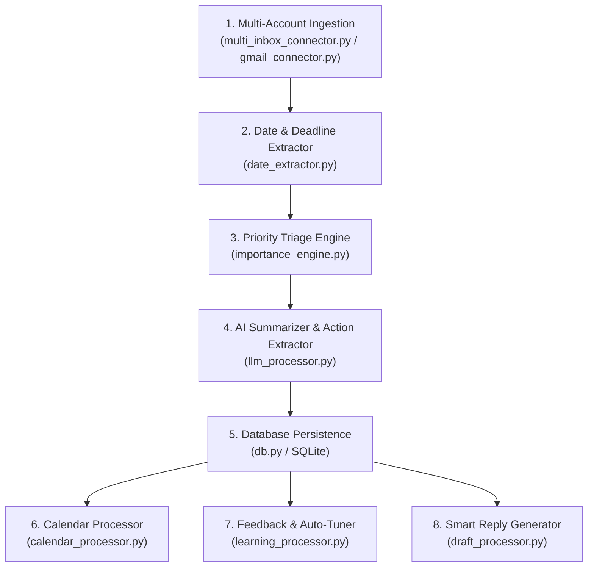

# 📬 Mail Expert AI — Smart Email Triage & Multi-Processor Engine

**Mail Expert AI** is an intelligent, privacy-first email triage engine and deadline manager. It parses emails, detects deadlines, calculates 0–1 importance scores based on urgency signals and customizable preferences, syncs multi-account email feeds, generates AI executive summaries & smart reply drafts, exports deadlines to Google Calendar, auto-tunes preferences from user activity, triggers native OS desktop reminders, and exposes a sleek web dashboard & Chrome Extension.

---

## ⚙️ Multi-Processor Architecture

Mail Expert AI processes emails through a modular 8-processor pipeline:



1. **Ingestion & Aggregation Processor (`multi_inbox_connector.py` / `gmail_connector.py`)**: Fetches emails across Gmail OAuth 2.0, Outlook, IMAP, or mock feeds with account-level tagging.
2. **Date & Deadline Extractor Processor (`date_extractor.py`)**: Detects anchored dates ("last date", "interview date") and relative time phrases ("within 24 hours", "in 3 days").
3. **Priority Triage Processor (`importance_engine.py`)**: Calculates 0.0–1.0 priority scores using urgency keywords, category weights, deadline proximity, and sender rules.
4. **AI Summarizer Processor (`llm_processor.py`)**: Dual-mode engine (Gemini/OpenAI API + offline extractive fallback) producing 1-2 sentence summaries & action item bullet lists.
5. **Storage & Persistence Processor (`db.py`)**: Persists emails, extracted dates, reminders, overrides, and account settings in `mail_expert.db` with auto-migrations.
6. **Calendar Processor (`calendar_processor.py`)**: Generates standard RFC 5545 `.ics` event files and 1-click Google Calendar web creation links.
7. **Self-Learning Auto-Tuner Processor (`learning_processor.py`)**: Analyzes manual user overrides ("Mark High", "Mark Low") to statistically auto-tune category weights.
8. **Smart Reply Generator Processor (`draft_processor.py`)**: Generates context-aware response drafts (Confirm slot, Request extension, Accept offer, Decline).

---

## 🌟 Key Features

- 🎯 **Intelligent 3-Tier Scoring**: `HIGH` ($\ge 0.7$), `MEDIUM` ($\ge 0.4$), and `LOW` tiers with full score breakdown explainability.
- 💡 **AI Executive Summaries & Action Items**: Automatic summaries and extracted to-do items.
- 📅 **Google Calendar & .ICS Export**: Export any extracted deadline directly to Apple Calendar, Outlook, or Google Calendar.
- 🧠 **Activity Auto-Tuning**: Machine learning heuristic that adapts triage scoring to your personal habits over time.
- ✍️ **Instant Smart Replies**: Draft professional responses with 1-click clipboard copying.
- 🔔 **Native Desktop Reminders**: Background process (`reminder_scheduler.py`) fires OS desktop popups (`plyer`) ahead of deadlines.
- 🎨 **Glassmorphism Web Inbox UI**: Sleek dark-mode dashboard with priority tabs, search, account filters, and modal controls.
- 🧩 **Chrome Extension Support**: Manifest V3 extension popup for quick triage straight from your browser bar.
- 🧪 **Comprehensive Automated Test Suite**: 20 unit and integration test cases covering all processors.

---

## 📁 Repository Structure

```
├── models.py                  # Pydantic schemas (Email, Preferences, AccountConfig, Reminder)
├── date_extractor.py          # Regex & relative deadline extraction processor
├── importance_engine.py      # Core priority triage scoring & explainability processor
├── llm_processor.py           # AI executive summarizer & action item extraction processor
├── calendar_processor.py      # iCalendar (.ics) export & Google Calendar link processor
├── learning_processor.py      # User feedback analysis & preference auto-tuning processor
├── draft_processor.py         # Contextual smart reply draft generator processor
├── multi_inbox_connector.py   # Multi-account & unified inbox feed aggregator
├── db.py                      # SQLite persistence layer with schema migrations
├── api.py                     # FastAPI REST server & Web Inbox Dashboard UI
├── gmail_connector.py         # Google OAuth 2.0 Gmail fetcher
├── reminder_scheduler.py      # Background OS desktop reminder notification service
├── start_app.py               # One-command full application launcher
├── seed_sample_emails.py      # Populates database with realistic sample emails
├── test_suite.py              # Automated 20-test unit & integration suite
├── example_usage.py           # Standalone CLI demo script
├── manifest.json              # Chrome Extension Manifest V3 configuration
├── popup.html / popup.js      # Chrome Extension UI popup
└── requirements.txt           # Python package dependencies
```

---

## 🚀 Quickstart

### 1. Install Dependencies
```bash
pip install -r requirements.txt
```

### 2. Seed Sample Dataset
```bash
python seed_sample_emails.py
```

### 3. Run Automated Tests
```bash
python test_suite.py
```

### 4. Launch Full Application (Server + Reminder Scheduler)
```bash
python start_app.py
```
*Opens the Web Inbox Dashboard at `http://127.0.0.1:8000/` and starts the desktop reminder service.*

---

## 🧩 Chrome Extension Setup

1. Open Chrome and navigate to `chrome://extensions/`.
2. Enable **Developer mode** (toggle in the top-right corner).
3. Click **Load unpacked** and select this project directory.
4. Click the Mail Expert AI icon in your browser bar while `api.py` or `start_app.py` is running to view top unread priority emails.
